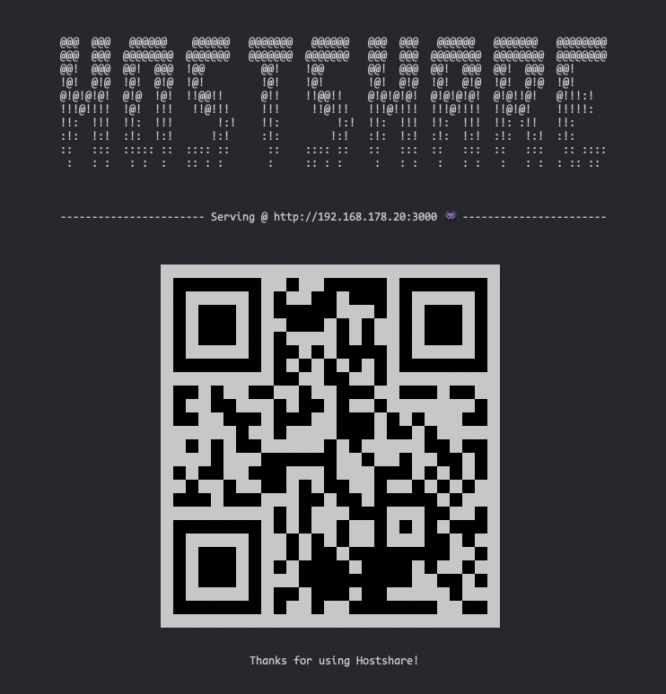

# Hostshare

## Install
- Download the script into your home directory

`$ curl -o ${HOME}/hostshare.sh https://raw.githubusercontent.com/pierreportal/hostshare/master/hostshare.sh`
- Make script executable

`$ chmod +x ${HOME}/hostshare.sh`
- Source the script inside `.zshrc`

`$ echo "source ${HOME}/hostshare.sh" >> ${HOME}/.zshrc`
- Source `.zshrc`

`$ source ${HOME}/.zshrc`

## Usage:
`$ hostshare <PORT>`

